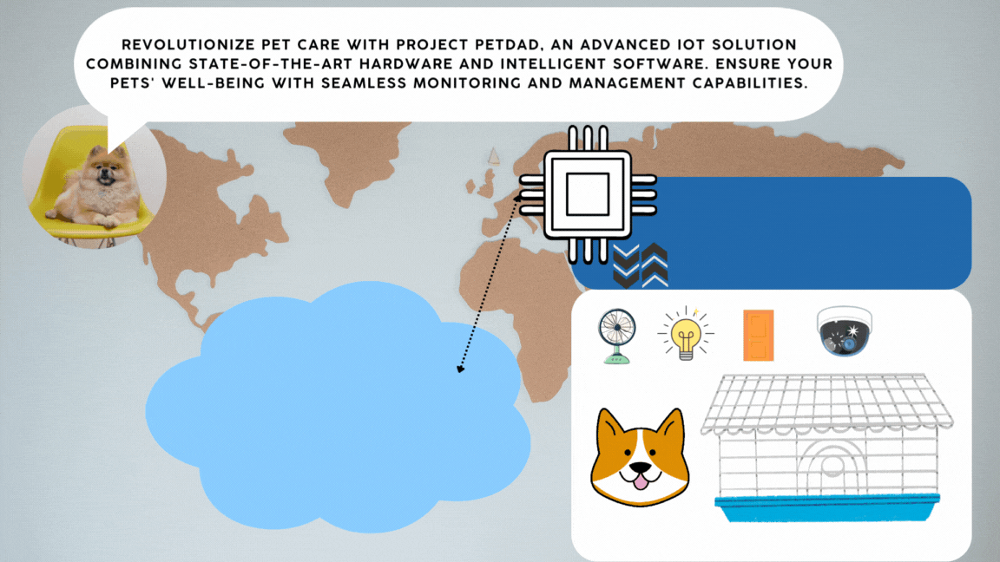

<header>
    <h1 class="text-3xl font-semibold text-green-500">
        Project PetDad - A Comprehensive IoT Solution for PetCare
    </h1>
    
 
    
        
    

    

        Revolutionize pet care with Project PetDad, an advanced IoT solution combining state-of-the-art hardware and intelligent software. Ensure your pets' well-being with seamless monitoring and management capabilities.
    

    
</header>
<section>
    <h2>Organized Dashboard for Quick Insights</h2>
    

        Stay informed at a glance with our well-organized dashboard that provides comprehensive overviews of your pets' key metrics and activities. Monitor their daily routines, health trends, and environmental conditions effortlessly.
    

    
</section>
<section>
    <h2>Effortless Authentication for Remote Pet Monitoring</h2>
    

        Enjoy secure and easy access to monitor and care for your pets from anywhere with our intuitive authentication system. Whether you're at home or traveling, stay connected and informed about your pets' activities and health status.
    

    
    
</section>

